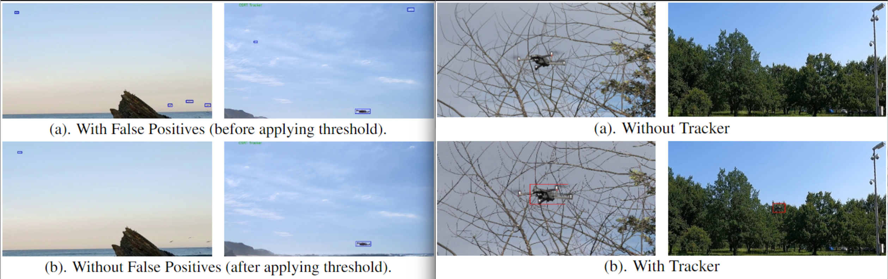

# **Drone-vs-Bird: Drone Detection Using YOLOv7 with CSRT Tracker** (Official implementation)  <!-- omit in toc -->
[](https://opensource.org/licenses/MIT)  

>#### [Drone-vs-Bird: Drone Detection Using YOLOv7 with CSRT Tracker](https://ieeexplore.ieee.org/document/10095146)
> ##### [(Sahaj K. Mistry](https://scholar.google.com/citations?user=54EbWw0AAAAJ&hl=en), [Ajeet K. Verma)](https://scholar.google.com/citations?user=PmR85OsAAAAJ&hl=en)

[[Paper]](https://ieeexplore.ieee.org/document/10095146)



## **Dataset**
The dataset was provided by the [WOSDETC](https://wosdetc2023.wordpress.com/drone-vs-bird-detection-challenge/) workshop & challenge [@ICASSP2023](https://2023.ieeeicassp.org/)  committee. To aquire the dataset you may contact the [committee](https://wosdetc2023.wordpress.com/committee/).

## **Usage**

#### **Processing Dataset**
To process the dataset, First of all, extract the images using the file `extract_images.ipynb` then split the dataset using `split.ipynb`

#### **Training & Testing [YOLOv7](https://github.com/WongKinYiu/yolov7)**
After processing the dataset, using `main_v7.ipynb` to clone, train, and test YOLOv7 on the processed dataset.

#### **Detect Drones Using YOLOv7**
Once the YOLOv7 is trained, use the `detect.py` file from cloned yolov7 folder to detect the drones and use `--save_text` argument to save the bounding boxes in txt file. 

#### **Using Tracker**
Use `tracker_yolo_output.ipynb` along with the video data and generated text file containing bounding boxes to get the **[CSRT Tracker](https://docs.opencv.org/3.4/d2/da2/classcv_1_1TrackerCSRT.html) Powered YOLOv7 Output** 

## **Citation**
```
@INPROCEEDINGS{10095146,
  author={Mistry, Sahaj K. and Chatterjee, Shreyas and Verma, Ajeet K. and Jakhetiya, Vinit and Subudhi, Badri N. and Jaiswal, Sunil},

  booktitle={ICASSP 2023 - 2023 IEEE International Conference on Acoustics, Speech and Signal Processing (ICASSP)}, 

  title={Drone-vs-Bird: Drone Detection Using YOLOv7 with CSRT Tracker}, 

  year={2023},

  keywords={Surveillance;Signal processing;Acoustics;Object tracking;Speech processing;Drones},

  doi={10.1109/ICASSP49357.2023.10095146}}

```


